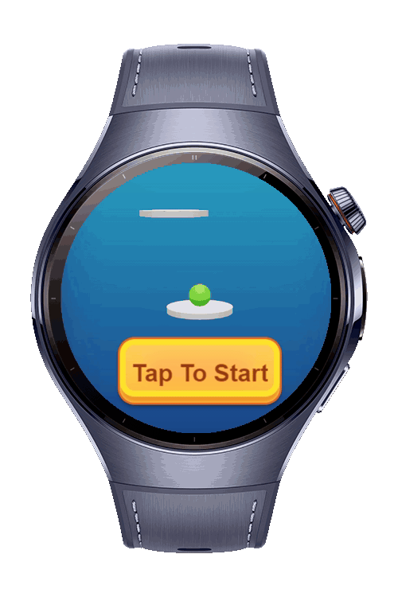

> **Note:** To access all shared projects, get information about environment setup, and view other guides, please visit [Explore-In-HMOS-Wearable Index](https://github.com/Explore-In-HMOS-Wearable/hmos-index).

# Bouncing Ball Game - HarmonyOS Next Wearable
This game demonstrates a **Cocos Creator** application optimized for **HarmonyOS Next** wearable devices. It features an engaging bouncing ball game with touch and swipe controls, specifically designed for small screen wearable devices. The game utilizes real-time physics, particle effects, and smooth camera tracking to deliver an immersive gaming experience on smartwatches and AR glasses.

# Preview
<div>



</div>

# Use Cases

## Game Mechanics

1) **Optimized Camera System** - Close-up camera positioning specifically designed for wearable device screens
2) **Touch & Swipe Controls** - Enhanced gesture recognition optimized for small touchscreens
3) **Performance Optimized** - Metrics disabled and optimized for wearable device hardware
4) **Multiple Board Types** - Normal, Spring, Drop, Giant, and Sprint boards with unique physics
5) **Score System** - Real-time score tracking with high score persistence
6) **Particle Effects** - Diamond collection effects and trail animations
7) **Revive System** - Second chance mechanism with countdown timer
8) **Sound Effects** - Background music and interactive audio feedback

## Scoring
- **Center Hit**: 2 points (hitting board center)
- **Edge Hit**: 1 point (hitting board edge)
- **Diamond Collection**: 1 point per diamond

## Controls
- **Touch & Hold**: Move ball horizontally
- **Swipe**: Quick directional movement (threshold: 50px)
- **3x Rapid Tap**: Toggle debug mode (optional)

# Tech Stack
- **Game Engine**: Cocos Creator 3.8.7
- **Languages**: TypeScript
- **Target Platform**: HarmonyOS Next (Wearable)
- **Graphics**: WebGL/OpenGL ES
- **Physics**: Custom physics implementation
- **Tools**: DevEco Studio 6.0.0.^

# Directory Structure

```
assets/
├── script/
│   ├── data/
│   │   └── constants.ts              # Game constants and configuration
│   ├── game/
│   │   ├── audio-manager.ts          # Audio playback management
│   │   ├── ball.ts                   # Ball physics and controls
│   │   ├── board.ts                  # Board behavior and effects
│   │   ├── board-manager.ts          # Board generation and pooling
│   │   ├── camera-ctrl.ts            # Camera tracking system
│   │   ├── game.ts                   # Main game controller
│   │   ├── page-result.ts            # Result screen UI
│   │   ├── page-start.ts             # Start screen UI
│   │   ├── revive.ts                 # Revive system logic
│   │   ├── ui-manager.ts             # UI state management
│   │   └── update-value-label.ts     # Score animation
│   └── utils/
│       ├── pool-manager.ts           # Object pooling system
│       └── utils.ts                  # Utility functions
├── prefabs/                          # Reusable game objects
├── scenes/                           # Game scenes
└── resources/                        # Assets (sprites, audio, etc.)
```

# Constraints and Restrictions

## Requirements
1. **Cocos Creator 3.8.7** or higher installed
2. **DevEco Studio 5.1.0.842** or higher for HarmonyOS builds
3. **HarmonyOS SDK 5.1.0(18)** configured
4. Configure signing settings for HarmonyOS
5. TypeScript strict mode compatibility

## Supported Devices
- Huawei Watch 5

# License

Bouncing Ball Game is distributed under the terms of the MIT License
See the [LICENSE](/LICENSE) for more information.